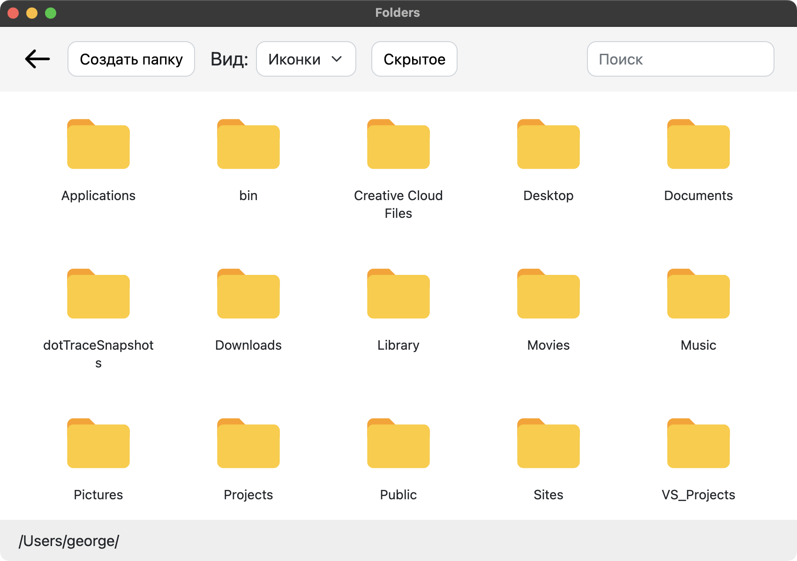
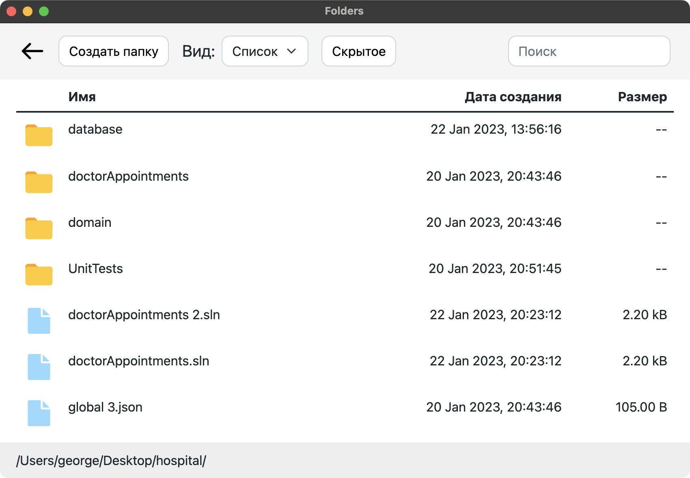
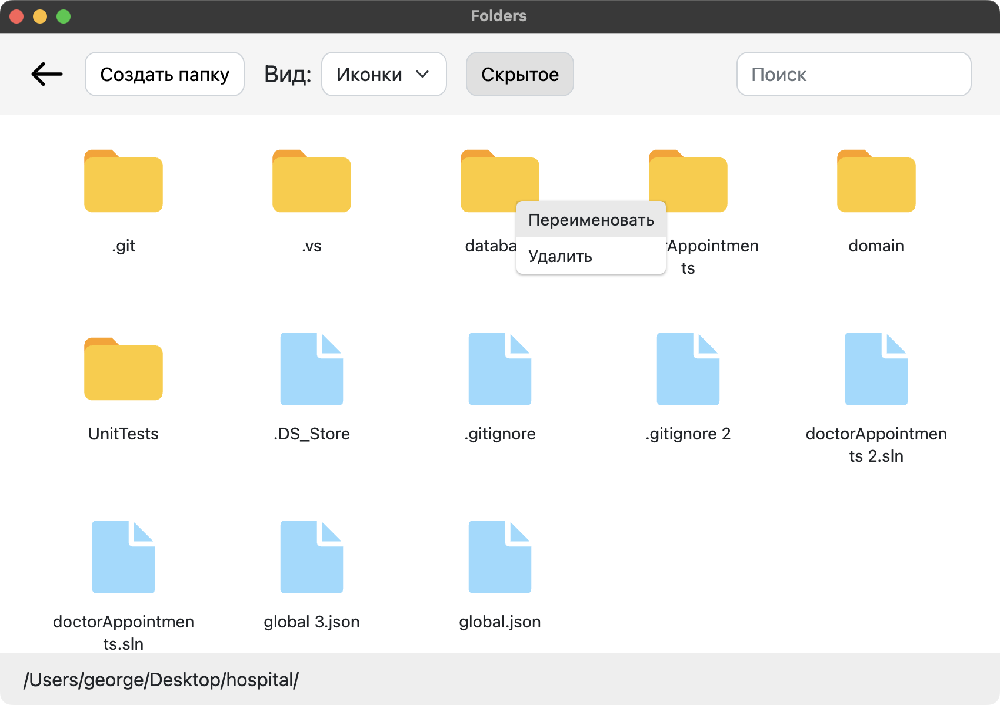

# Folders-app

## Preview




## Requirements to develop and deploy

1) Node.js 16.15.0 and NPM
2) VueCLI 5.0.4 
    
## Setup

1) `vue create project-name`
2) `cd project-name`
3) copy and paste my project files into current directory
4) `npm install`

Now you're ready to explore and modify!

### Compiles and hot-reloads for development

Change `"devTools: false"` to "true" under webPreferences in `background.js` to enable Web Inspector.
```
npm run electron:serve
```

### Compiles and minifies for production
```
npm run electron:build
```
#### WARNING: Originally made for macOS. If you're using Windows make sure to change paths in components in Windows-like way!
